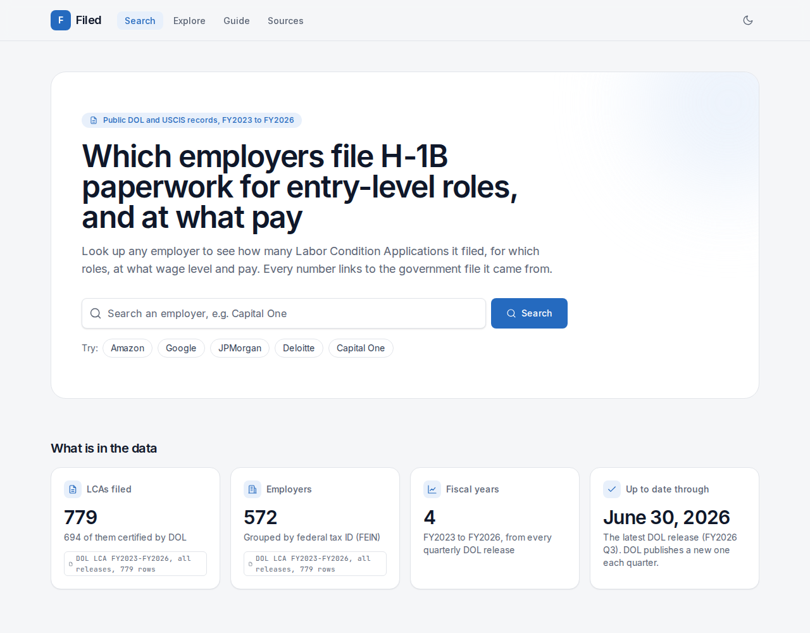
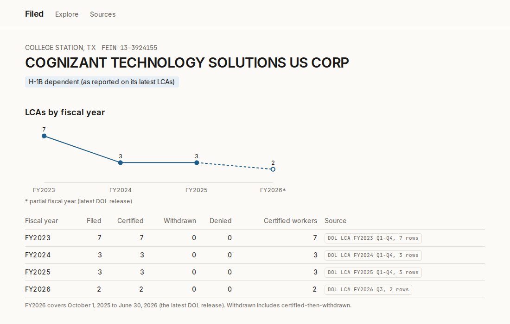

# Filed

**Which employers actually file H-1B paperwork for entry-level software and finance roles, and at what pay.**

Filed is a search tool built only from U.S. government records: every Labor Condition Application in the Department of Labor disclosure files for FY2023 to FY2026 (2,136,934 cases) and the USCIS H-1B Employer Data Hub. Type a company to see how many LCAs it filed, for which roles, at what wage level and pay, and how many petitions USCIS approved. Or go the other way: which employers in Virginia file Level I software LCAs.

Every figure on the site carries a source tag (for example "DOL LCA FY2025 Q1-Q4, 728 rows") that links to the file it came from.

Live site: https://filed-gray.vercel.app (deploys from `main` on Vercel; see [docs/deploy.md](docs/deploy.md))





<sub>Screenshots of the test build, which runs on a sample of about 800 real LCA rows (`filed seed`), so the counts are the sample's, not the employer's full totals.</sub>

## How to read an employer page

The site's own [guide](https://filed-gray.vercel.app/guide) explains every term in plain English. In short:

1. **At a glance.** Four tiles sum the employer up: certified LCAs and median offered pay in the latest year, the entry-level share, and USCIS initial approvals. Each says what it means and where it comes from.
2. **Header.** The employer is one federal tax ID (FEIN). City and state are where most of its LCAs say it is. Badges show whether it was H-1B dependent on its latest LCAs, whether any LCA reported it as a willful violator, and "No LCA match" when only USCIS has a record of it.
3. **LCAs by fiscal year.** The line and table count Labor Condition Applications, not visas. Certified means DOL certified the form; an employer files one before an H-1B petition. A hollow point with a dashed line is a partial year (the latest DOL release covers October to June).
4. **Source tags.** The small grey labels ("DOL LCA FY2025 Q1-Q4, 728 rows") name the file and the number of rows behind a figure. They link to /sources, which lists every file with its download date and SHA-256.
5. **Offered pay.** The lower bound of the pay range on certified, full-time LCAs, annualized. The bar spans the 25th to 75th percentile; the tick is the median. By role group, percentiles are per fiscal year and never combined across years.
6. **Wage level mix.** The prevailing wage level the employer chose on each LCA (I is entry level). Since the FY2027 cap season the lottery weighs registrations by wage level, which is why the level matters.
7. **Entry-level signal.** A count: certified LCAs in software, data, finance and quant roles at level I or II, and their share of the employer's certified LCAs, over the last two loaded years. It is not a probability of sponsorship.
8. **USCIS petition decisions.** Approvals and denials from the USCIS H-1B Employer Data Hub, matched by name, state and the last four tax ID digits. A dash means the figure is not in the file or no record matched; it never means zero.
9. **Related legal entities and similar employers.** Related entities share a normalized name but file under a different FEIN (for example two ASML legal entities); their numbers are never merged. Similar employers share this employer's NAICS industry code and state.

## Numbers

| Check | Result | Report |
| --- | --- | --- |
| Raw rows loaded vs rows in the source files | 100% on all 17 DOL files and the USCIS file | `data/manifest.json` |
| Reconcile: certified, withdrawn, denied and filed counts per year, recomputed from the raw xlsx with pandas | **0 differences** across FY2023 to FY2026 | [eval/reconcile.md](eval/reconcile.md) |
| Name normalizer on 60 hand-labeled pairs | precision 88.2%, recall 85.7% | [eval/employers.md](eval/employers.md) |
| Full resolver (FEIN first) on the same pairs | precision 100%, recall 100% | [eval/employers.md](eval/employers.md) |
| USCIS to LCA join, FY2023 | 74.8% of USCIS employers, 87.3% of approvals | [eval/join.md](eval/join.md) |
| Wages excluded as unit errors | 4,570 of 2,136,934 (0.21%) | [eval/wages.md](eval/wages.md) |

## Data sources

- **DOL OFLC LCA disclosure data** (H-1B, H-1B1, E-3), https://www.dol.gov/agencies/eta/foreign-labor/performance. All four quarterly files for FY2023 to FY2025 (they are not cumulative, despite what one might assume) and FY2026 Q3 (October 1, 2025 to June 30, 2026), plus the worksites file for each year.
- **USCIS H-1B Employer Data Hub**, FY2023 file, https://www.uscis.gov/archive/h-1b-employer-data-hub-files. Later years are only published in the hub's interactive viewer.

Definitions are in [docs/definitions.md](docs/definitions.md). Every judgment call (column drift, blank rows, placeholder FEINs, how FY2023 rows without a FEIN are linked) is in [docs/decisions.md](docs/decisions.md).

## How it works

```
data/raw/        DOL xlsx and USCIS csv (not committed) + data/manifest.json (hash, rows)
etl/ingest.py    per-file column maps, row count check against the sheet XML, DuckDB
etl/wages.py     annualize wages, flag unit errors
etl/employers.py group by FEIN, normalize names, record possible links, never merge FEINs
etl/uscis_join.py match USCIS to LCA employers on name + state + last 4 tax ID digits
etl/aggregate.py per employer per fiscal year tables, explore cube, entry-level signal
etl/load.py      COPY into a new Neon schema, swap it in inside one transaction
web/             Next.js 15 server components reading Postgres (pg_trgm search)
```

Run the pipeline (files listed in [docs/download.md](docs/download.md) must be in `data/raw/`, or restored with `uv run filed fetch` from the raw store, [docs/raw-store.md](docs/raw-store.md)):

```bash
uv sync
uv run filed status                  # which steps are current, which will run
uv run filed all --no-load           # every step whose inputs changed
uv run python scripts/reconcile.py --against duckdb    # must print 0
DATABASE_URL=... uv run filed all    # load Neon (and revalidate the site if configured)
uv run python scripts/reconcile.py
```

The monthly `etl` workflow does the same in GitHub Actions, and `release-watch` opens an
issue when DOL or USCIS publish newer files. See [docs/operations.md](docs/operations.md)
and, for database size, [docs/postgres-growth.md](docs/postgres-growth.md).

## Tests

```bash
uv run pytest -q                      # ETL; load tests need TEST_DATABASE_URL (a throwaway Postgres)
cd web && pnpm test                   # Vitest: formatting, /explore parsing and SQL
DATABASE_URL=postgres://localhost/filed_e2e uv run filed seed   # pipeline on tests/fixtures
cd web && pnpm build && pnpm e2e      # Playwright against that seeded database
```

`filed seed` runs every ETL step on the committed fixture slices (real LCA rows, synthetic
USCIS counts) and loads the result, so the site and the load step are tested in CI without
Neon. It refuses a Neon URL. See docs/decisions.md D21.

## Limitations

- An LCA is filed before a petition. It shows that an employer intended to hire into a role, not that a visa was approved.
- USCIS data lags. The latest USCIS year loaded is FY2023.
- Employers are matched by federal tax ID (FEIN) and name, so one company can be split across legal entities (Amazon.com Services and Amazon Web Services are separate employers) and a few USCIS records fail to join. FY2023 LCA files omit the FEIN, so FY2023 cases are linked by name and state (94.4% linked).
- "Likely cap-exempt" (universities and research nonprofits, which hire outside the lottery) is a stated rule on NAICS codes and names, and on IRS records when that file is loaded; it is not a USCIS determination ([decisions D30](docs/decisions.md)).
- Legal entities are grouped above FEIN only through a small hand-reviewed parent map (`data/parents.csv`), shown apart from the FEIN-level figures.
- Internships usually run on CPT and first jobs on OPT, which these files do not cover.

Not legal advice. Past filings do not guarantee future sponsorship.
